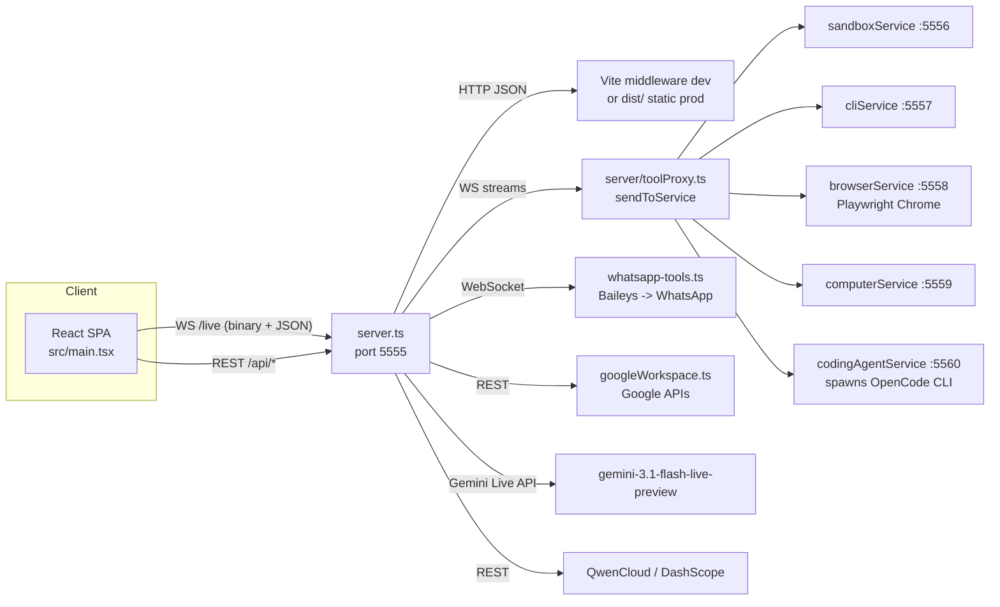
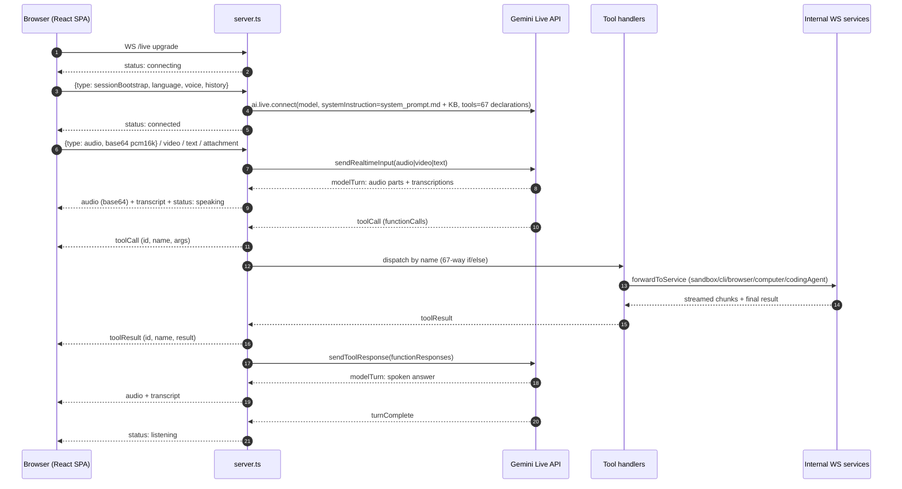
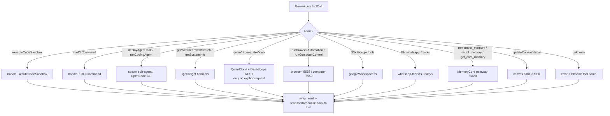
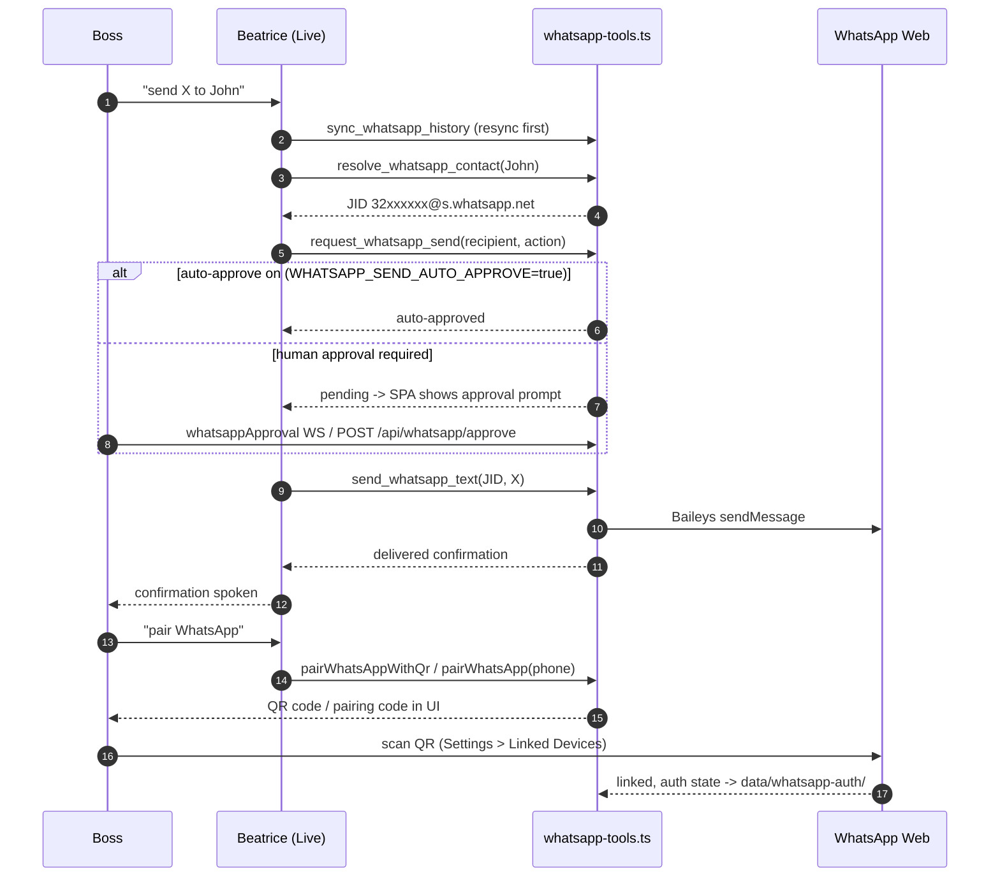
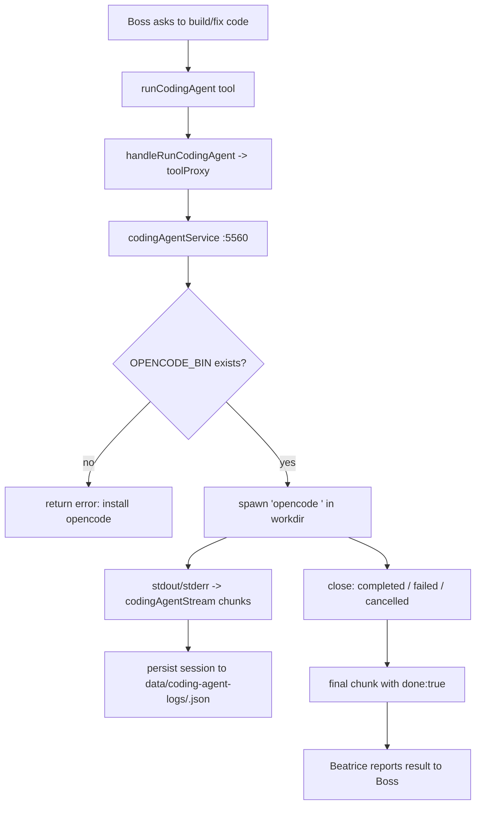
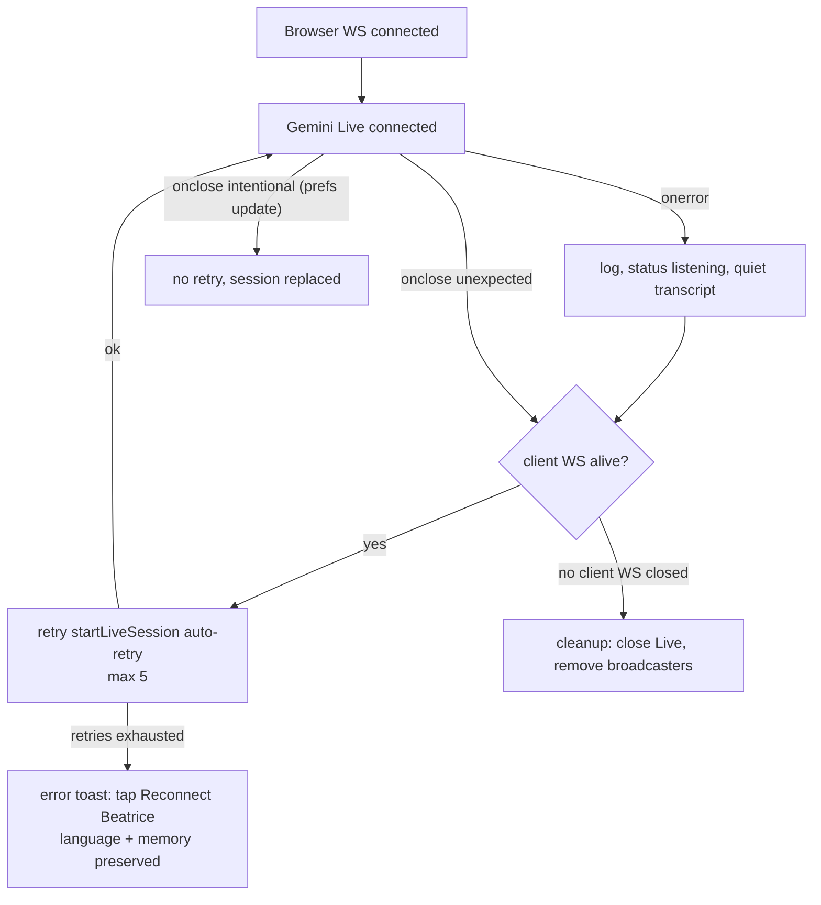
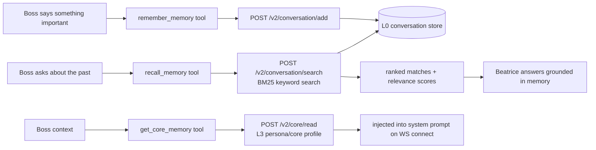
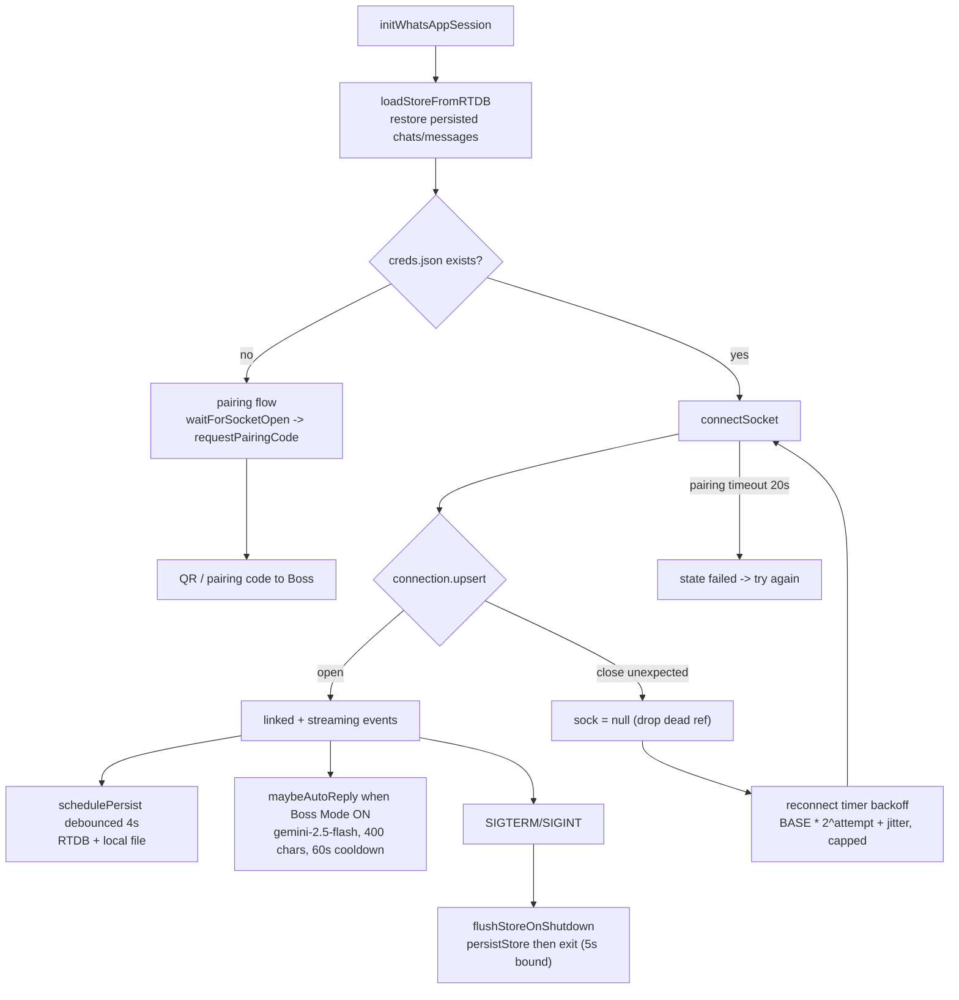
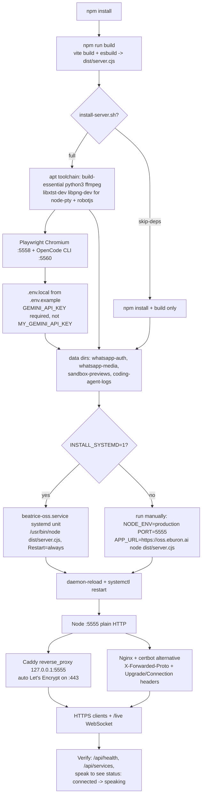

# App Logic — Beatrice OSS

How the system actually works at runtime. All flows below are traced from `server.ts`, `server/tools.ts`, `server/toolProxy.ts` and `server/services/`.

## Runtime topology

## 1. Live voice conversation (end-to-end)

Notes:
- The browser WS is the **only** connection to the browser — one socket carries audio in both directions, transcripts, tool calls/results, and streamed service output.
- Language/voice/persona come from the bootstrap and can be updated live via `updateSessionPrefs` (soft-restarts the Live session only).
- A `bootstrap` delay of 1.5s guards against starting Live before the client sends prefs.

## 2. Tool call dispatch

Every path: broadcast `toolCall` → run handler → broadcast `toolResult` → `liveSession.sendToolResponse({functionResponses})` so Gemini turns the result into speech.

## 3. WhatsApp flow (send + pairing)

## 4. Coding agent delegation

The coding agent's default model comes from `~/.config/opencode/opencode.jsonc` (Zen free model `opencode/deepseek-v4-flash-free`); it inherits the server's env (keys in `.env.local`).

## 5. Reconnection & resilience

## 6. Manual tool triggers (no voice)

The same handlers are reachable without Gemini: the SPA sends `runSandbox`, `runCli`, `deployAgent`, `getSystemInfo`, `updateCanvas`, `getWeather`, `webSearch`, `runSandboxStream`, `runCliStream`, `runBrowser`, `runComputer`, `runCodingAgent`, `cancelCodingAgent` WS messages — each is dispatched to the same real handler as the voice path and broadcast as `toolCall`/`toolResult` (so the UI stays consistent).

## 7. Message contract (client ⇄ server, WS `/live`)

| Direction | type | Payload |
|---|---|---|
| client→server | `sessionBootstrap`, `restartLive`, `updateSessionPrefs` | bootstrap: language/voice/history/custom persona |
| client→server | `audio` / `video` / `text` / `attachment` | base64 pcm16k audio, jpeg frames, text, file attachments |
| client→server | `whatsappApproval` | id + approve + recipient |
| server→client | `audio` | base64 Gemini audio |
| server→client | `transcript` | role user/model/system + text (partial flag while streaming) |
| server→client | `toolCall` / `toolResult` | id + name + args/result |
| server→client | `status` | connecting / connected / speaking / listening / error |
| server→client | `interrupted`, `turnComplete` | turn lifecycle |
| server→client | `sandboxOutput`, `cliOutput`, `browserUpdate`, `computerUpdate`, `codingAgentUpdate`, `canvasUpdate`, `videoGenerationUpdate`, `qwencloudUpdate`, `whatsappStatus` | streamed tool output |

## 8. REST endpoints

| Route | Purpose |
|---|---|
| `GET /api/health` | status + model + key configured |
| `GET /api/services` | tool service ports 5556–5560 |
| `POST /api/tools/execute-code` · `/api/tools/cli` · `/api/tools/agent` · `/api/tools/canvas` · `/api/tools/weather` · `/api/tools/search` | direct tool invocations |
| `GET /api/workspace/gmail/messages` · `/api/workspace/contacts` · `POST /api/workspace/gmail/send` · `/api/workspace/forms/create` · `GET /api/workspace/forms/list` | Google Workspace over REST |
| `GET /api/whatsapp/status` · `/capabilities` | WhatsApp health |
| `POST /api/whatsapp/pair` · `/pair-qr` · `/cancel` · `/logout` · `/approve` | WhatsApp lifecycle |
| `GET /api/sandbox/preview/:file` | proxy sandbox HTML previews (frontend iframe) |
| `GET /privacy` · `/terms` | public static pages (no auth) |

## 9. Memory learning (MemoryCore)

Beatrice saves and recalls conversations via the local MemoryCore gateway (`127.0.0.1:8420`, auth via `TDAI_LLM_API_KEY` / `TDAI_LLM_SERVICE_ID`).

## 10. WhatsApp lifecycle, Boss Mode & shutdown

Boss Mode details: when ON, `maybeAutoReply` auto-replies to incoming DMs (`@s.whatsapp.net`, skips own/`3A`-broadcast/stub msgs) using Gemini `gemini-2.5-flash` (`getLocalGemini` lazy import), mimicking the Boss's style from `getWhatsAppKnowledgeBase(force)` (contacts + style + recent conversations, 5-min cache). Max 400 chars, 60s cooldown per chat, marks read. Toggle via `set_whatsapp_boss_mode` tool or `GET/POST /api/whatsapp/boss-mode`; persisted in `data/whatsapp-auth/.meta.json`.

Shutdown: `SIGTERM`/`SIGINT` → `flushStoreOnShutdown` clears reconnect/heartbeat/persist timers and calls `persistStore()` before exit (5s bound), so the newest messages aren't dropped by the 4s debounce during restarts.

## 11. Deployment flow

Deployment notes: never run two instances per host (fixed ports 5556–5560 clash); the proxy must forward `Upgrade`/`Connection` headers or `/live` fails; WhatsApp pairing, Google connect, and `opencode auth login` are interactive one-time steps. See `DEPLOYMENT.md` for the full guide.