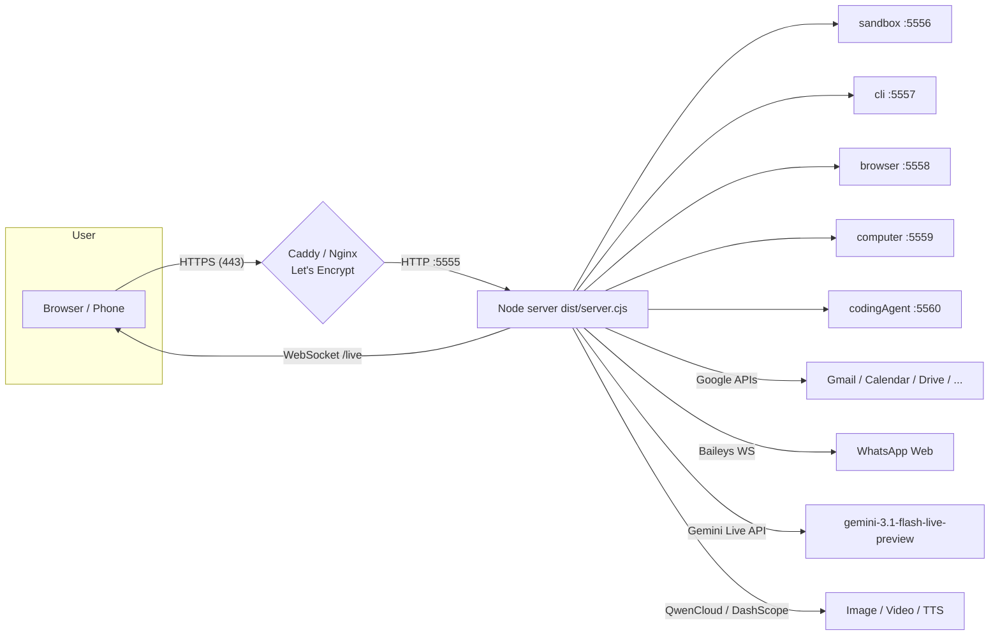

# Deployment Guide — Beatrice OSS

Production deployment of the Beatrice voice assistant (Express + Vite SPA + WebSocket `/live` + Gemini Live streaming + internal tool services).



## 1. Prerequisites

| Requirement | Notes |
|---|---|
| Node.js 18+ | npm is the canonical package manager (`bun.lock` exists but is not used) |
| `GEMINI_API_KEY` | Required. Real key in `.env.local` (gitignored); placeholder `MY_GEMINI_API_KEY` fails at runtime |
| `DASHSCOPE_API_KEY` | Required for `qwen*` + `generateVideo` tools |
| Firewall | Open TCP `5555` inbound (or only `443` if behind a proxy on the same host) |
| Camera/mic | Only needed at the client (voice/video features) |
| WhatsApp pairing | Interactive — needs the operator to scan a QR/pairing code once (persisted in `data/whatsapp-auth/`) |
| Google OAuth | Client-side via Firebase (`firebase-applet-config.json`); server-side creds optionally in `google-web-credentials.json` |

## 2. Environment variables

| Variable | Default | Purpose |
|---|---|---|
| `GEMINI_API_KEY` | — | Live API + Gemini-backed tools (must not be `MY_GEMINI_API_KEY`) |
| `DASHSCOPE_API_KEY` | — | QwenCloud chat/image/video/TTS + DashScope video |
| `PORT` | `5555` | HTTP port |
| `APP_URL` | `http://localhost:5555` | Public URL used for links/broadcasts |
| `NODE_ENV` | — | `production` switches from Vite middleware to serving `dist/` |
| `DISABLE_HMR` | — | `true` disables Vite HMR/watch (recommended headless) |
| `SANDBOX_SERVICE_PORT` … `CODING_AGENT_PORT` | 5556–5560 | Internal tool service ports |
| `OPENCODE_BIN` | `/root/.opencode/bin/opencode` | CLI spawned by `runCodingAgent` |
| `WHATSAPP_AUTH_DIR` | `data/whatsapp-auth` | Baileys auth state |
| `WHATSAPP_SEND_AUTO_APPROVE` | `true` | `false` forces human approval for outgoing WhatsApp |

dotenv loads `.env` then overrides with `.env.local`. Use `.env.local` for secrets (gitignored).

## 3. Automated install — `install-server.sh` (developers)

Full provisioning script at the repo root. It installs the OS toolchain, then `npm install` + builds. **The internal tool services (sandbox/CLI/browser/computer/coding agent) are not separate processes — `server.ts` starts all five on boot; the script only provisions what they need.**

```bash
sudo bash install-server.sh                  # full install (Ubuntu/Debian)
bash install-server.sh --skip-deps           # code-only re-install (no apt/playwright/opencode)
INSTALL_SYSTEMD=1 sudo bash install-server.sh  # also create/enable systemd unit
```

| Step in script | What it installs | Why (which service uses it) |
|---|---|---|
| §1 apt packages | `build-essential`, `python3`, `ffmpeg`, `libxtst-dev`, `libpng-dev` | native builds of `node-pty` (cliService) and `robotjs` (computerService) — `npm install` **fails without them**; python3 for sandbox Python runs; ffmpeg for media workflows |
| §2 Playwright | headless Chromium (+ system deps) | browserService on :5558 (`npx playwright install --with-deps chromium`) |
| §3 OpenCode CLI | `~/.opencode/bin/opencode` | codingAgentService on :5560 (spawns `OPENCODE_BIN`); config `~/.config/opencode/opencode.jsonc` (Zen free default model) |
| §4 sandbox check | python3 present? | sandboxService on :5556 (JS/TS/HTML run in-process via `vm`) |
| §5 environment | `.env.local` from `.env.example` | secrets: `GEMINI_API_KEY` (required, not `MY_GEMINI_API_KEY`), `DASHSCOPE_API_KEY`, `PORT`, `APP_URL` |
| §6 data dirs | `data/whatsapp-auth`, `whatsapp-media`, `sandbox-previews`, `coding-agent-logs` | WhatsApp Baileys state, sandbox artifacts, agent session logs |
| §7–8 build | `npm install` + `npm run build` → `dist/server.cjs` | prod entrypoint |
| §9 (opt) systemd | `beatrice.service` | auto-restart + boot persistence |

**Sandbox / service integration model (important for developers):**
- `server.ts:999-1003` calls `startSandboxService()` … `startCodingAgentService()` at boot — services bind `127.0.0.1:5556-5560` and are **only reachable locally** (never expose them publicly).
- Tool calls (`server/tools.ts`) forward over WebSocket to `ws://127.0.0.1:<port>/stream` via `server/toolProxy.ts`; the browser UI can also drive them directly with `runSandboxStream`-style WS messages.
- Ports are overridable: `SANDBOX_SERVICE_PORT`, `CLI_SERVICE_PORT`, `BROWSER_SERVICE_PORT`, `COMPUTER_SERVICE_PORT`, `CODING_AGENT_PORT`.
- Do **not** run two app instances on one host — the fixed service ports will clash (first instance wins, second startup fails).
- After `install-server.sh`, complete interactively: WhatsApp pairing (Settings → WhatsApp), Google connect (Settings → Google Services), and optionally `~/.opencode/bin/opencode auth login` for the coding agent.

Manual build & run (equivalent to what the script does):

```bash
npm install
npm run build          # vite build && esbuild server.ts -> dist/server.cjs
NODE_ENV=production PORT=5555 APP_URL=https://oss.eburon.ai node dist/server.cjs
```

Dev mode (same process, no build):

```bash
npm run dev            # tsx server.ts  (Vite middleware + HMR)
```

Serving model:
- dev (`NODE_ENV != production`) — Vite middleware inside Express
- prod — `express.static(dist)` + SPA fallback `app.get('*', … index.html)`

Process management: run under `systemd` or `pm2`, restart on crash (`uncaughtException`/`unhandledRejection` are logged but fatal exits are expected to be recovered by the supervisor).

## 4. Developer notes (sandbox & service integration)

- **Sandbox execution routes**: `executeCodeSandbox` first tries `ws://127.0.0.1:5556/stream` (streaming result), and falls back to **in-process execution** (`vm` for JS/TS/HTML, `exec` otherwise) if the service is down — tools stay usable on degraded hosts.
- **CLI sessions**: `runCliCommand` uses the CLI service's session model (`startSession` → `runCommand` streaming); a long-running command streams per-line output to the workspace.
- **Coding agent**: sessions run in the workspace cwd (env `CODING_AGENT_WORKSPACE` or the `cwd` arg), stream `codingAgentStream` chunks, and persist a per-session JSON to `data/coding-agent-logs/<sessionId>.json` on completion.
- **Browser service**: one persistent Playwright/Chromium session per tab; actions (`goto`/`click`/`type`/`read`/`scroll`) stream `browserUpdate` events for the UI.
- **Testing locally without voice**: drive every tool handler directly through the REST `/api/tools/*` endpoints or the workshop WS messages (`runSandbox`, `runCli`, `runBrowser`, …) — no microphone needed.

## 5. HTTPS — required for WebSockets in production browsers

The server speaks plain HTTP on `PORT`. Terminate TLS at a reverse proxy on port 443.

### Option A — Caddy (recommended)

`Caddyfile` (already in repo):

```
oss.eburon.ai {
    reverse_proxy 127.0.0.1:5555
}
```

```bash
caddy run --config Caddyfile
```

Caddy auto-provisions Let's Encrypt certs and forwards `X-Forwarded-Proto` + Upgrade headers automatically.

### Option B — Nginx + certbot

`nginx-oss.conf` (already in repo) — the critical bits:

```nginx
location / {
    proxy_pass http://127.0.0.1:5555;
    proxy_set_header X-Forwarded-Proto $scheme;
    proxy_set_header Upgrade $http_upgrade;      # required for /live WS
    proxy_set_header Connection "upgrade";
}
```

```bash
certbot --nginx -d oss.eburon.ai
```

⚠️ Without the `Upgrade`/`Connection` headers the `/live` WebSocket silently fails.

## 6. Verification

| Check | Command / URL |
|---|---|
| Health | `GET /api/health` → `{"status":"ok","liveModel":"gemini-3.1-flash-live-preview", …}` |
| Tool services | `GET /api/services` → ports 5556–5560 |
| WhatsApp | `GET /api/whatsapp/status` (paired?), `/api/whatsapp/capabilities` |
| Live session | Open the app, speak — watch `status: connected` then `speaking` WS messages |
| Coding agent | `POST /api/tools/…` or trigger `runCodingAgent`; logs land in `data/coding-agent-logs/` |

## 7. Operational notes

- **Do not run a second instance** — the tool services bind fixed ports 5556–5560; a clash kills startup.
- **Model/voice are hardcoded** in `server.ts` (`gemini-3.1-flash-live-preview`, voice `Aoede`); the system prompt is `system_prompt.md`, regenerated from `make_prompt.cjs`.
- **Live auto-retry** — server keeps the browser WS alive and retries the Live session up to 5 times on drop, preserving language + memory bootstrap.
- **WhatsApp approvals** — with `WHATSAPP_SEND_AUTO_APPROVE=false`, sends wait on `POST /api/whatsapp/approve` or the `whatsappApproval` WS message.
- **Data storage** — everything persists under `data/` (gitignored): WhatsApp auth/media, sandbox previews, coding-agent logs. Back it up.
- **Secrets hygiene** — `.env.local`, `google-web-credentials.json`, `*client-secret.json` are gitignored — never `git add -f` them.
- **Updating the prompt** — edit `make_prompt.cjs`, run `node make_prompt.cjs`, restart the server (prompt is loaded on WS connect).