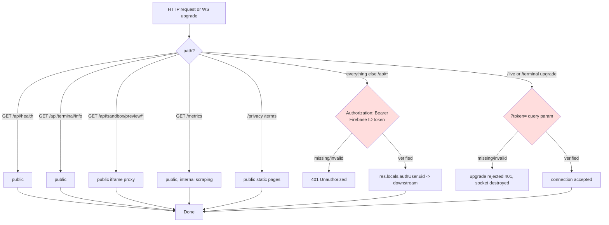
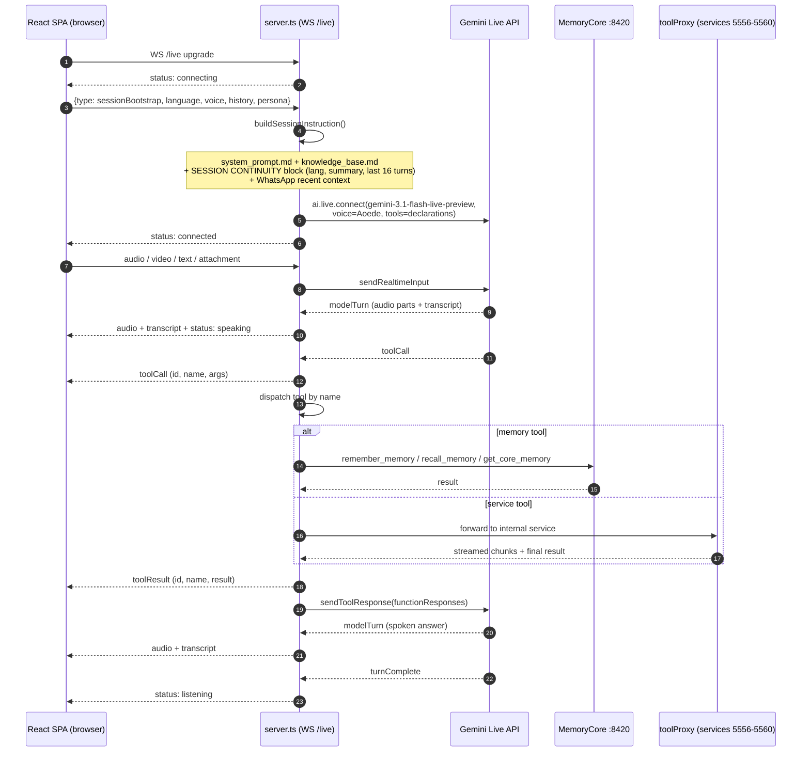
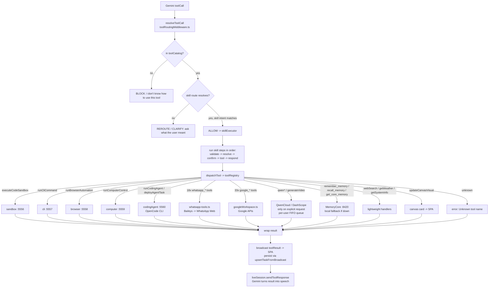
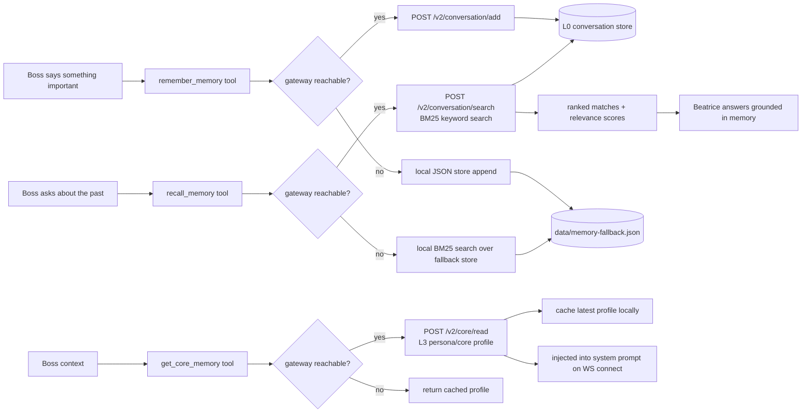
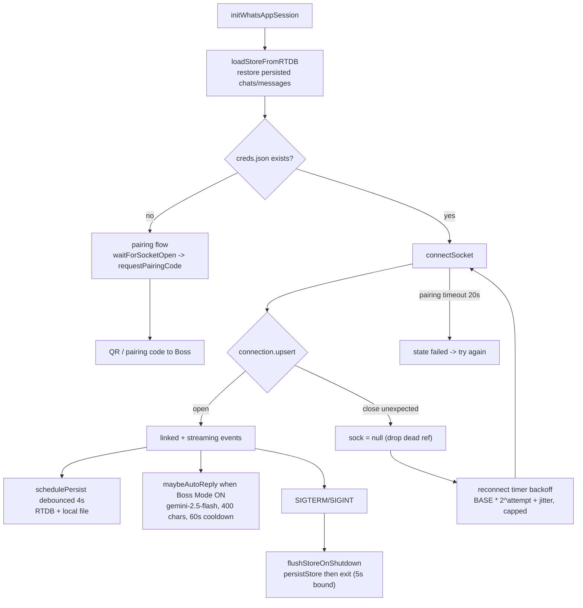
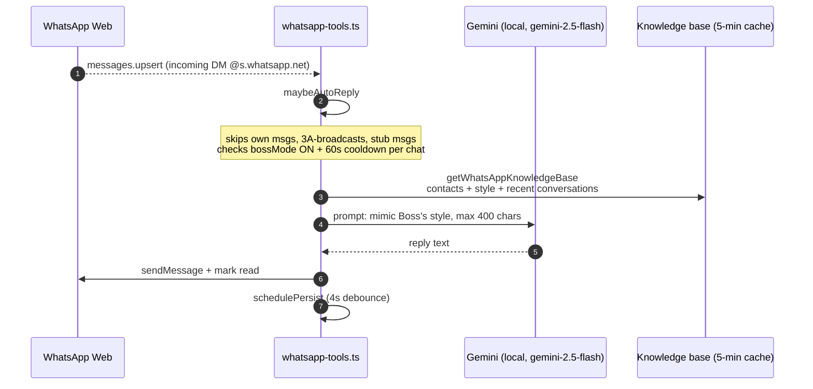
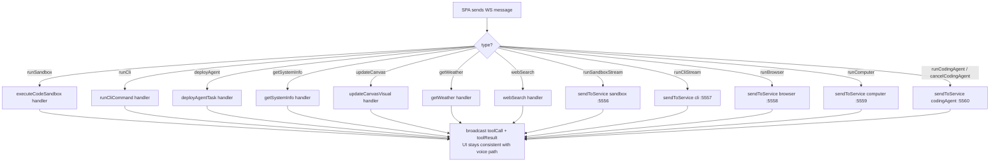
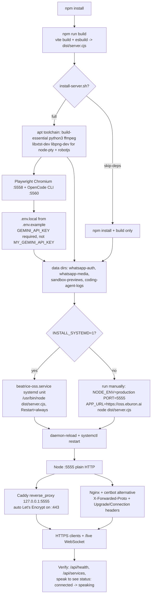

# Flow — Beatrice OSS (current runtime)

Mermaid diagrams traced from `server.ts`, `server/whatsapp-tools.ts`, `server/toolProxy.ts`, and `server/services/`. Complements `APP_LOGIC.md` with the memory tools and graceful-shutdown additions. Auth (Firebase ID-token verification), the tool registry, and the skill-routing layer (queryRouter → skillRouter → skillExecutor → toolCatalog → toolRoutingMiddleware) are the newest layers — see AGENTS.md for their module layout.

## 0. Authentication gate (all API + WS entry points)



Token verification uses `jose` (JWKS + RS256) in `server/auth.ts` — do **not** switch back to `firebase-admin`'s `verifyIdToken()`. `AUTH_DISABLED=1` turns the gate off for local dev (then the legacy `x-wa-uid`/`x-wa-email` headers are honored for WhatsApp). Verified uid is used for per-user WhatsApp sessions, the task store, and Google OAuth token lookups (`google_tokens/{uid}` in RTDB).

## 1. Server boot & component topology

```mermaid
flowchart TD
    BOOT[startServer] --> VAL[validateToolCoverage<br/>declarations == catalog == registry]
    VAL --> SVC[Start internal WS services]
    SVC --> P1[sandboxService :5556]
    SVC --> P2[cliService :5557]
    SVC --> P3[browserService :5558<br/>Playwright Chrome]
    SVC --> P4[computerService :5559]
    SVC --> P5[codingAgentService :5560<br/>spawns OpenCode CLI]

    BOOT --> HTTP[Express app :PORT (default 5555)]
    HTTP --> WS[WS /live + /terminal upgrade handler]
    HTTP --> REST[/api/health, /api/tools/*, /api/workspace/*,<br/>/api/whatsapp/*, /api/tasks]
    HTTP --> VITE[Vite middleware dev<br/>or dist/ static prod]

    BOOT --> TSK[initTaskStore<br/>in-memory + RTDB tasks/{uid}]
    BOOT --> MEM["MemoryCore gateway<br/>127.0.0.1:8420 (external service)<br/>with local JSON fallback"]
    WA[whatsapp-tools.ts module load] --> WA2[initWhatsAppSession unless WHATSAPP_AUTO_INIT=0]
    WA2 --> BA[Baileys connectSocket -> WhatsApp Web]
    WA --> FLUSH[SIGTERM/SIGINT -> flushStoreOnShutdown<br/>clear timers + persistStore, 5s bound]

    PROXY[server/toolProxy.ts sendToService] --> P1
    PROXY --> P2
    PROXY --> P3
    PROXY --> P4
    PROXY --> P5
    WS --> PROXY
```

## 2. Live session bootstrap (per client WS connection)



## 3. Tool call dispatch (71 tools, via registry + skill routing)

Every Gemini function call enters `handleFunctionCallWithSkills` (`server/toolRoutingMiddleware.ts`) and is decided ALLOW / REROUTE / CLARIFY / BLOCK before dispatch:



Declarations live in `server/toolDeclarations.ts` (moved out of server.ts). Boot-time `validateToolCoverage()` and `validateSkillCoverage()` fail fast if the declarations, the catalog (`server/toolCatalog.ts`), the registry, or the skill routes drift out of sync. Media tools hit two DashScope hosts with per-model routing (`imageEndpointFor()`/`videoEndpointFor()` in `server/tools.ts`): image `qwen-image-2.0-pro` → `z-image-turbo` (intl) → `wan2.7-image-pro`/`wan2.7-image` (Token Plan); video `happyhorse-1.1-t2v` (intl) → `wan3.0-video` (intl); TTS `qwen-audio-3.0-tts-plus` (Token Plan).

## 4. Memory learning flow (MemoryCore, with local fallback)



Fallback store is a capped (1000-entry) JSON file at `data/memory-fallback.json` (`MEMORY_FALLBACK_FILE` override for tests); successful gateway reads refresh the cached core profile so `get_core_memory` keeps working while the gateway is down.

## 5. WhatsApp lifecycle & reconnect



## 6. Boss Mode auto-reply (incoming DM)



## 7. WS message contract (client ⇄ server, `/live`)

| Direction | type | Payload / effect |
|---|---|---|
| client→server | `sessionBootstrap` | bootstrap: language, voice, history, persona → starts Live (1.5s bootstrap timer fallback) |
| client→server | `restartLive` | re-start Live session (soft restart) |
| client→server | `updateSessionPrefs` | update language/voice/persona → soft-restart Live |
| client→server | `audio` / `video` / `text` / `attachment` | base64 pcm16k audio, jpeg frames, text, files → sendRealtimeInput |
| client→server | `whatsappApproval` | id + approve + recipient → approveWhatsAppSend |
| client→server | `runSandbox` / `runCli` / `deployAgent` / `getSystemInfo` / `updateCanvas` / `getWeather` / `webSearch` | manual tool triggers (no Gemini), broadcast as toolCall/toolResult |
| client→server | `runSandboxStream` / `runCliStream` / `runBrowser` / `runComputer` / `runCodingAgent` / `cancelCodingAgent` | direct dispatch to internal service via toolProxy |
| server→client | `audio` | base64 Gemini audio |
| server→client | `transcript` | role user/model/system + text (partial flag while streaming) |
| server→client | `toolCall` / `toolResult` | id + name + args/result |
| server→client | `status` | connecting / connected / speaking / listening / error |
| server→client | `interrupted`, `turnComplete` | turn lifecycle |
| server→client | `sandboxOutput`, `cliOutput`, `browserUpdate`, `computerUpdate`, `agentUpdate`, `codingAgentUpdate`, `canvasUpdate`, `videoGenerationUpdate`, `qwencloudUpdate`, `whatsappStatus`, `skillExecutionUpdate` | streamed tool output (skillExecutionUpdate tracks skill step progress) |

## 8. REST endpoints

| Route | Purpose |
|---|---|
| `GET /api/health` | status, app, live model, API-key configured (public) |
| `GET /api/terminal/info` | SSH host/port/user for the browser terminal (public) |
| `GET /api/services` | internal service ports + ws stream URLs (5556–5560) |
| `GET /api/tasks` · `POST /api/tasks` · `GET/PATCH/DELETE /api/tasks/:id` | per-user generation task history (RTDB-backed, requires verified uid) |
| `POST /api/tools/execute-code` · `/api/tools/cli` · `/api/tools/agent` · `/api/tools/canvas` · `/api/tools/weather` · `/api/tools/search` | direct tool invocations (no WS needed) |
| `GET /api/workspace/gmail/messages` · `/api/workspace/contacts` · `POST /api/workspace/gmail/send` · `/api/workspace/forms/create` · `GET /api/workspace/forms/list` | Google Workspace over REST |
| `GET /api/whatsapp/status` · `/api/whatsapp/capabilities` | WhatsApp health + internal action catalog |
| `POST /api/whatsapp/pair` (phone) · `/api/whatsapp/pair-qr` · `/api/whatsapp/cancel` · `/api/whatsapp/logout` · `/api/whatsapp/approve` | WhatsApp lifecycle + send approval |
| `GET /api/whatsapp/boss-mode` · `POST /api/whatsapp/boss-mode` | read/set Boss Mode toggle |
| `POST /api/whatsapp/reset` | hard-reset a stuck WhatsApp session (403-banned socket) |
| `GET /api/sandbox/preview/:file` | proxy sandbox HTML previews (frontend iframe, public) |
| `GET /privacy` · `/terms` | public static pages (no auth) |
| `GET *` (prod) | SPA fallback → `dist/index.html` |

Video generation (`generateVideo` / `qwenVideoGenerate`) is enqueued in a per-user FIFO queue (`server/tools.ts`): one render runs server-wide at a time, each user may hold at most one running + one queued job, and queued jobs broadcast a `queued` status with their position. Memory tool results are returned with `source: 'local-fallback'` when the MemoryCore gateway is unreachable.

## 9. Manual tool triggers (no voice)



Each manual trigger reuses the exact same handler as the voice path, so state is identical regardless of entry point.

## 10. Deployment flow (build → serve → proxy)



Deployment notes:
- Never run two app instances per host — internal services bind fixed ports 5556–5560 and clash on boot.
- The proxy **must** forward `Upgrade`/`Connection` headers or the `/live` WebSocket silently fails.
- After install: WhatsApp pairing (Settings), Google connect, `opencode auth login` are interactive one-time steps.
- `SIGTERM` (systemctl restart) triggers `flushStoreOnShutdown` in whatsapp-tools.ts — clears timers and persists the WhatsApp store before exit (5s bound), so no messages are lost on restart.
