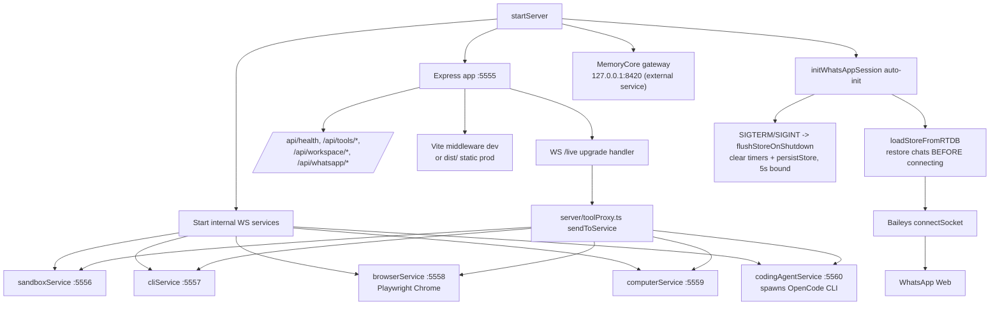
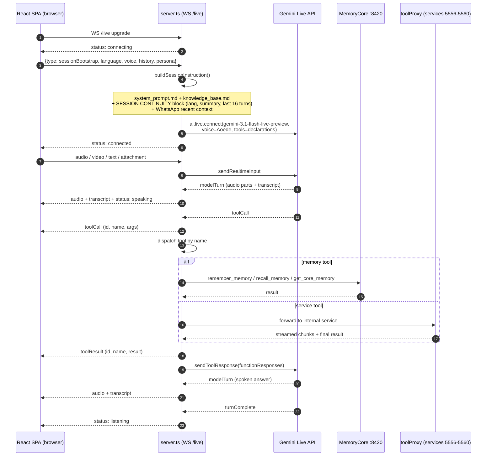
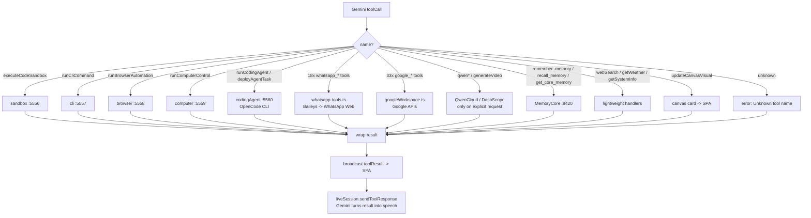
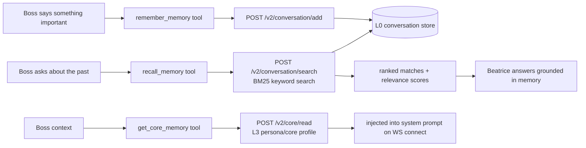
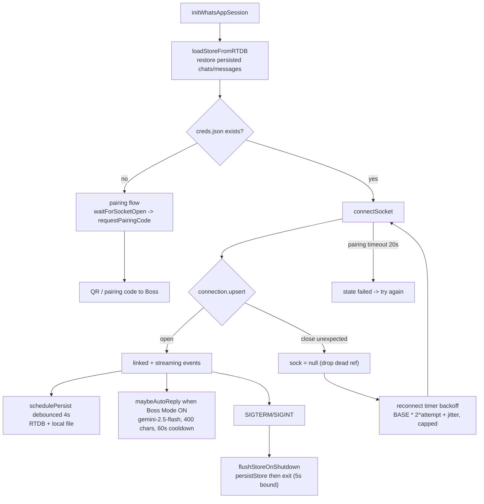
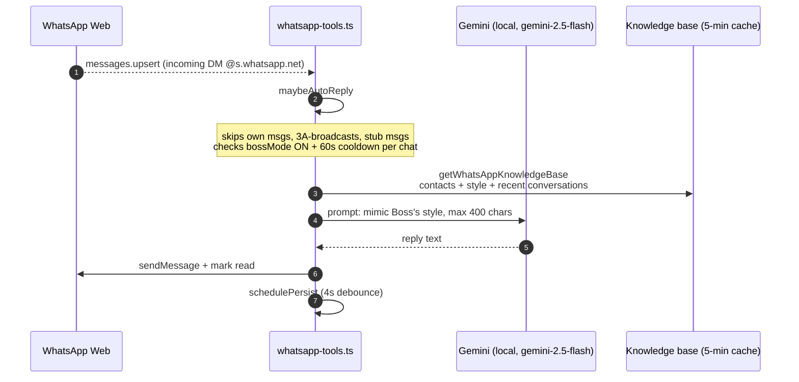
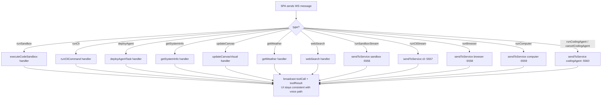
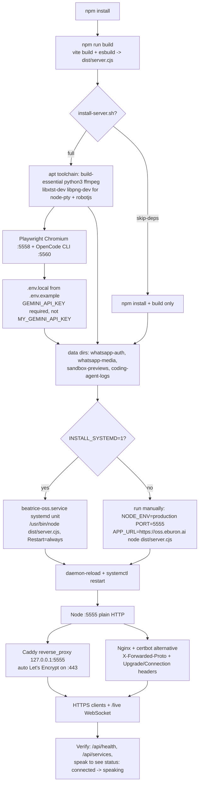

# Flow — Beatrice OSS (current runtime)

Mermaid diagrams traced from `server.ts`, `server/whatsapp-tools.ts`, `server/toolProxy.ts`, and `server/services/`. Complements `APP_LOGIC.md` with the memory tools and graceful-shutdown additions.

## 1. Server boot & component topology

## 2. Live session bootstrap (per client WS connection)

## 3. Tool call dispatch (67 tools)

## 4. Memory learning flow (MemoryCore)

## 5. WhatsApp lifecycle & reconnect

## 6. Boss Mode auto-reply (incoming DM)

## 7. WS message contract (client ⇄ server, `/live`)

| Direction | type | Payload / effect |
|---|---|---|
| client→server | `sessionBootstrap` | bootstrap: language, voice, history, persona → starts Live (1.5s bootstrap timer fallback) |
| client→server | `restartLive` | re-start Live session (soft restart) |
| client→server | `updateSessionPrefs` | update language/voice/persona → soft-restart Live |
| client→server | `audio` / `video` / `text` / `attachment` | base64 pcm16k audio, jpeg frames, text, files → sendRealtimeInput |
| client→server | `whatsappApproval` | id + approve + recipient → approveWhatsAppSend |
| client→server | `runSandbox` / `runCli` / `deployAgent` / `getSystemInfo` / `updateCanvas` / `getWeather` / `webSearch` | manual tool triggers (no Gemini), broadcast as toolCall/toolResult |
| client→server | `runSandboxStream` / `runCliStream` / `runBrowser` / `runComputer` / `runCodingAgent` / `cancelCodingAgent` | direct dispatch to internal service via toolProxy |
| server→client | `audio` | base64 Gemini audio |
| server→client | `transcript` | role user/model/system + text (partial flag while streaming) |
| server→client | `toolCall` / `toolResult` | id + name + args/result |
| server→client | `status` | connecting / connected / speaking / listening / error |
| server→client | `interrupted`, `turnComplete` | turn lifecycle |
| server→client | `sandboxOutput`, `cliOutput`, `browserUpdate`, `computerUpdate`, `codingAgentUpdate`, `canvasUpdate`, `videoGenerationUpdate`, `qwencloudUpdate`, `whatsappStatus` | streamed tool output |

## 8. REST endpoints

| Route | Purpose |
|---|---|
| `GET /api/health` | status, app, live model, API-key configured |
| `GET /api/services` | internal service ports + ws stream URLs (5556–5559) |
| `POST /api/tools/execute-code` · `/api/tools/cli` · `/api/tools/agent` · `/api/tools/canvas` · `/api/tools/weather` · `/api/tools/search` | direct tool invocations (no WS needed) |
| `GET /api/workspace/gmail/messages` · `/api/workspace/contacts` · `POST /api/workspace/gmail/send` · `/api/workspace/forms/create` · `GET /api/workspace/forms/list` | Google Workspace over REST |
| `GET /api/whatsapp/status` · `/api/whatsapp/capabilities` | WhatsApp health + internal action catalog |
| `POST /api/whatsapp/pair` (phone) · `/api/whatsapp/pair-qr` · `/api/whatsapp/cancel` · `/api/whatsapp/logout` · `/api/whatsapp/approve` | WhatsApp lifecycle + send approval |
| `GET /api/sandbox/preview/:file` | proxy sandbox HTML previews (frontend iframe) |
| `GET /privacy` · `/terms` | public static pages (no auth) |
| `GET *` (prod) | SPA fallback → `dist/index.html` |

## 9. Manual tool triggers (no voice)

Each manual trigger reuses the exact same handler as the voice path, so state is identical regardless of entry point.

## 10. Deployment flow (build → serve → proxy)

Deployment notes:
- Never run two app instances per host — internal services bind fixed ports 5556–5560 and clash on boot.
- The proxy **must** forward `Upgrade`/`Connection` headers or the `/live` WebSocket silently fails.
- After install: WhatsApp pairing (Settings), Google connect, `opencode auth login` are interactive one-time steps.
- `SIGTERM` (systemctl restart) triggers `flushStoreOnShutdown` in whatsapp-tools.ts — clears timers and persists the WhatsApp store before exit (5s bound), so no messages are lost on restart.
